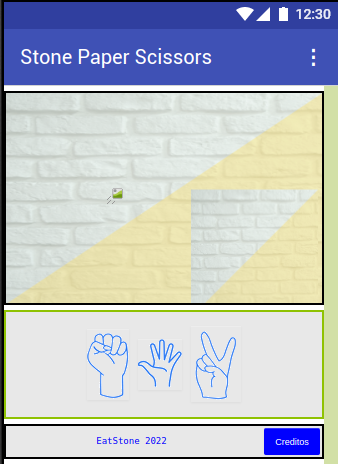

# StonePaperScissors

Este proyecto es el resultado del aprendizaje del curso de Plazti **"Proyectos Creativos para Niñas y Niños"**
Consiste en elaborar una APP para Android desde MIT APP INVENTOR, y es el juego de piedra papel o tijera, se juega contra el smartphone
En la pantalla aparecen las tres opciones y despues de seleccionar tu opción el smartphone de manera aleatoria selecciona su opción. Y muestra al segundo el resultado del ganador. Se puede volvar a jugar.

## Captura de pantalla 

## Utilidades

Herramienta para redimensionar los dibujos
https://www.resizepixel.com/es/download

Herramienta para hacer transparencia en los dibujos
http://transparent.imageonline.co/es/

Herramienta para generar los dibujos
https://www.autodraw.com/

Herramienta oaga generar el fondo
https://www.canva.com/

Para acceder al conetido de la aplicacion
http://ai2.appinventor.mit.edu/?ng=29149c58-1a6b-432e-991c-4dc29045ed81#5681727057297408
